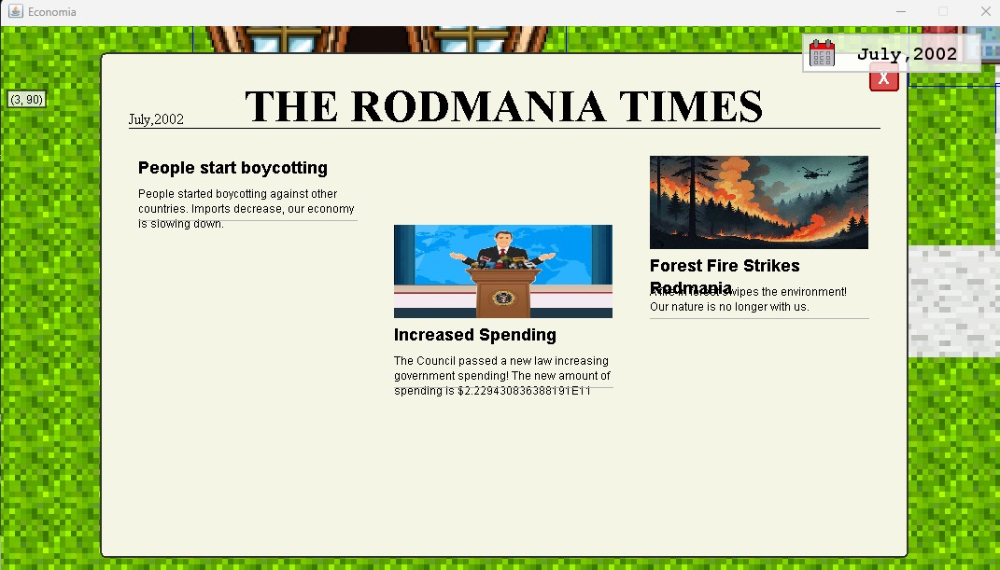
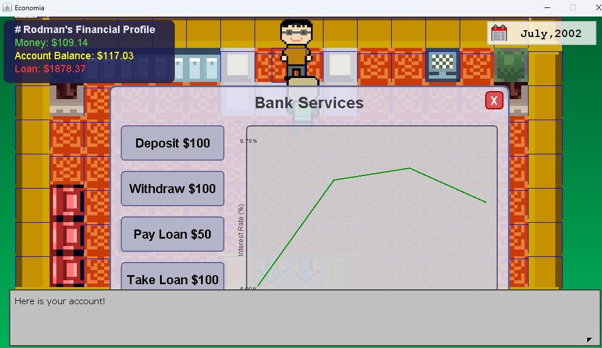
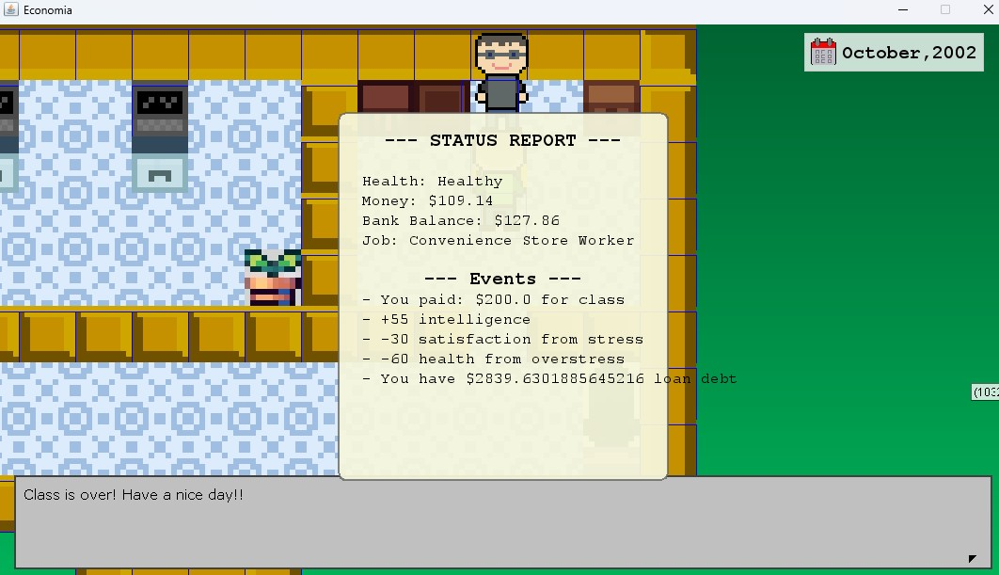
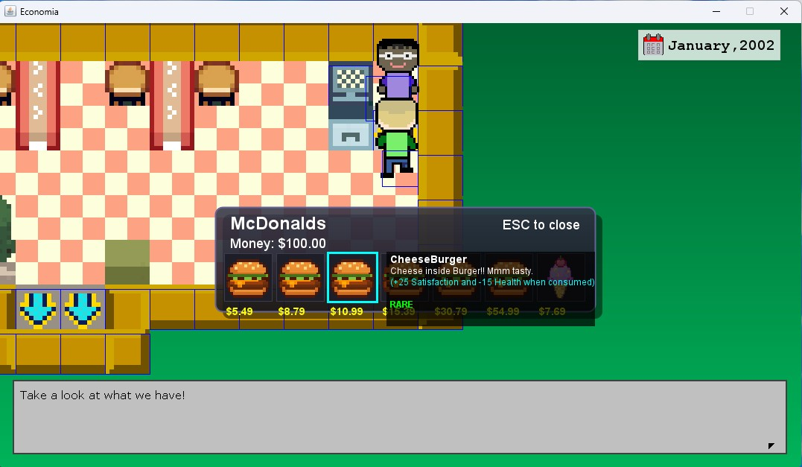

# Economia

## A 2D Economics Simulation RPG Built From Scratch in Java

Economia is a Pokemon-style 2D game where the player experiences an economy through everyday decisions. You walk around a town, get a job, take out loans, pay taxes, and watch the national economy react to your decisions and random world events — all while managing your health, satisfaction, and intelligence stats.

## Why I Started This Project

In 10th grade, I took AP Java and AP Micro/Macroeconomics. I understood the economic concepts we studied and became interested in bringing them to life in a game. At the same time, I wanted to build something much bigger than the class assignments and push my Java and object-oriented programming skills further.

So I combined the two. I built a simulation game where GDP growth, interest rates, taxation, government spending, and inflation affect the player’s choices and the economy. The player has to manage these changes while staying healthy, happy, and out of debt.

My Java teachers were impressed enough to strongly encourage their classes to try the game, and my Economics teacher also responded very positively to the project.

## How It Works

### 1. Country Simulation

Every in-game "month" (triggered by sleeping in bed), the country class simulates a full macroeconomic cycle:

* Collects taxes from national GDP based on the current tax rate
* Splits government revenue into public spending (70%) and defense spending (20%)
* Grows GDP by the national growth rate
* Draws 3 random news events per month from a pool of ~20 possible events, including tax hikes, spending cuts, interest rate changes, gold rushes, forest fires raising production costs, war, invasion, bankruptcy, and others
* If the country goes to war, a separate pool of war-only events (bombings, battles, surrender, victory) takes over
* Tracks interest rate, tax rate, and spending history in lists and graphs them in-game

### 2. Personal Finance

The player has a purse (cash on hand), a bank balance, and can take out or pay off loans through a Bank NPC(Banker).

Each month:

* Income tax is deducted based on the country's tax rate
* House rent is charged, and rent itself scales with the tax rate
* Outstanding debt accrues interest based on the national interest rate
* Bank savings earn interest at the same national rate
* Going into too much debt locks the player out of the bank and lowers Satisfaction and Health

This connects the player's personal finances directly to changes in the country's monetary policy. Raising interest rates makes loans more expensive while making savings more rewarding.

### 3. Jobs, Shops, and Firms

The player can work jobs such as McDonald's Worker or Convenience Store Worker. Jobs require a minimum Intelligence stat and trade Satisfaction for income.

Shops are run by `Firm` objects that sell `Product` objects with independent cost, production cost, and demand. A firm's profit each turn is calculated as demand times (price minus production cost), creating a simplified supply-and-demand model.

### 4. Player Stats and Survival

The player has four main stats: Health, Satisfaction, Intelligence, and Luck.

These stats change based on the player's choices:

* Working raises stress and lowers Satisfaction
* Studying costs money but raises Intelligence
* Debt pressure lowers Satisfaction and eventually Health
* Items such as food and accessories can be bought and consumed to restore stats
* If Health reaches zero, the game ends

### 5. World Interaction

News is delivered through an in-game newspaper, while monthly outcomes are summarized in a turn report.

A branching dialogue system provides tutorials and conversations with shopkeepers and bankers through a Pokemon-style chat box.

### 6. Custom Level Editor

Alongside the game, I built a separate Map Editor tool that let me design the town's buildings and layout visually instead of editing map files by hand.

## Technologies

* Java
* Java AWT / Swing for graphics and GUI
* Java audio (`javax.sound.sampled`)
* Object serialization for save/load
* Custom Map Editor for designing game maps

## Source Code

The source code is organized into several main parts:

* **Core Game:** Player movement, stats, inventory, maps, and game flow
* **Economy:** National economy, jobs, firms, products, banking, and random events
* **Game Systems & UI:** Shops, newspaper, turn reports, and dialogue
* **Map Editor:** A separate tool for designing and saving game maps

## What I Learned

Working through the entire process of making a game gave me a glimpse of how a real game development project comes together. I planned the game scenario and logic, found and organized sound and graphic resources, created and revised characters, and redesigned the game map many times. I even made the main character look like my Economics teacher, which really touched him.

I went through countless rounds of trial and error, debugging, and revisions. The biggest challenge came at the end, when I had to create an MSI installer so others could install and play the game on their own computers. I kept debugging and revising until I got it working. Seeing my teachers and friends actually play the game and give me positive feedback made all the work worthwhile.

